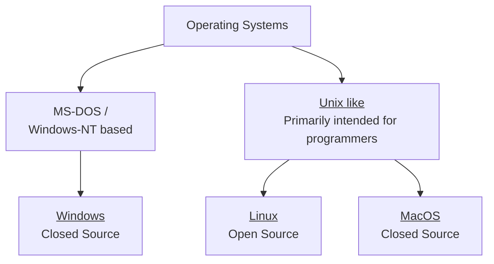
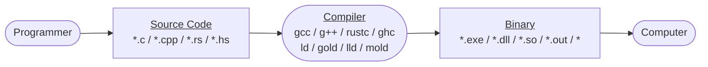
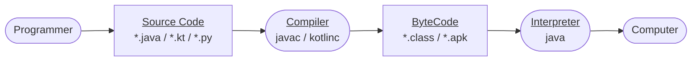
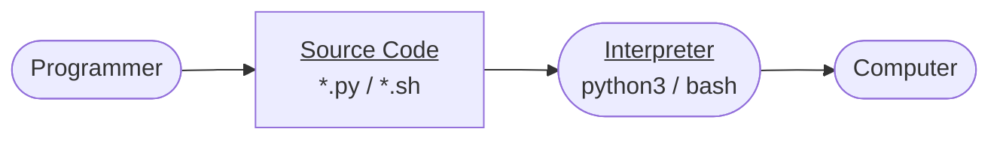

# FOSS x CP x WEB

<style>
h1 {
  color: white !important;
}
</style>


---

<div class="text-center" style="font-size: 50px; padding: 40px;">

Before we start

</div>

Whoever hasn't installed Linux on their machine, be sure to be connected to WiFi & run this on your PowerShell:

<pre class="text-center" style="font-size: 30px;">

wsl --install

</pre>


---

<style>
.meme-start {
  height: 400px;
  margin: auto;
  margin-top: 40px;
}
</style>

<div class="text-center" style="font-size: 50px;">

Let's start


</div>


---

# Outline

* Operating Systems
* What is Linux?
  - Examples
* Ways of using Linux
* Source-Compiler-Binary Analogy
* Environment Setup (VSCode)
* Hello World on C with
* Simple HTTP server with NodeJS
* Extend the analogy we discussed earlier


---

# Operating Systems

<div class="text-center" style="padding: 40px;">



</div>

* **Windows-NT:** Mouse is primary source of interaction
* **Unix:** Keyboard is primary source of interaction

---

<style>
.what-is-linux-points li {
  margin-top: 25px;
}
</style>

# What is Linux?

<div class="what-is-linux-points">

* Free and Open Source OS based on UNIX.
* Is the one powering 96.3% of the top 1M websites today.
* The only operating-system targeting both the embedded devices (car's music/video system) and the world's most powerful supercomputers.
* Backbone of Android powering over 85% of the daily internet users.
</div>


---

<style>
iframe {
    margin: auto;
}

.page-height {
  height: 500px;
  margin: auto;
}
</style>


---

<iframe width="560" height="315" src="https://www.youtube.com/embed/Wu7ArqGOYYg?controls=0" title="YouTube video player" frameborder="0" allow="accelerometer; autoplay; clipboard-write; encrypted-media; gyroscope; picture-in-picture; web-share" allowfullscreen></iframe>


---

<iframe id="reddit-embed" src="https://www.redditmedia.com/r/unixporn/comments/uvaat7/gnome_3d_desktop_and_other_fun_effects/?ref_source=embed&amp;ref=share&amp;embed=true&amp;theme=dark" sandbox="allow-scripts allow-same-origin allow-popups" style="border: none;" height="515" width="640" scrolling="no" allowfullscreen></iframe>


---

<iframe id="reddit-embed" src="https://www.redditmedia.com/r/unixporn/comments/hgba3b/i3_razer_blade_stealth_highlighting_shortcuts_and/?ref_source=embed&amp;ref=share&amp;embed=true&amp;theme=dark" sandbox="allow-scripts allow-same-origin allow-popups" style="border: none;" height="495" width="640" scrolling="no" allowfullscreen></iframe>


---

# Ways of using Linux

1. WSL on Windows
2. Virtual Machine
3. Native Installation (Dual-Booting / Single-Booting)


---

# Ways of using Linux

## 1. WSL on Windows

Pros:

* In both the options (dual-or-single-boot / virtual-machine) you'll need to tweak laptop through BIOS to run them. WSL2 installs and run swiftly.
* Laptops released just this year may not have good Linux support, as such wifi may not work, which is a big issue.
<br>

Cons:

* Since you're still on Windows, you can't customize the desktop however you like as you would in linux.
* Since windows isn't light, you won't get the performance benefits, a native linux can offer (No lags).
<br>

<sub>**Note:** WSL is already getting installed in background with `wsl --install` y'all ran earlier.</sub>

---

# Ways of using Linux

## 2. Virtual Machine

<div style="margin-top: 10px;" />

Pros:

* Is a way to run Linux with GUI under a window. So you *can* customize the desktop however you like.
<br>

Cons:
* But is even worse in performance, as it's too heavy and mostly laggy even in high-performance CPU.
* Doesn't integrate with Windows too nicely. As you'll see later in the slides.
<br>

[VM Installation resource](https://aadi58002.github.io/Linux-Blog/guide/Linux/Installation.html#virtual-machine)

<style>
h3 {
    color: skyblue;
}
</style>


---

# Ways of using Linux

### 3. Native Installation (Dual-Booting / Single-Booting)

Pros:

* You can customize desktop however you like & can setup different functional workflows that can boost your productivity.
* You get customization, performace, security, stability, and everything a linux can offer.
* You can easily debug your setup if it fails later.

Cons:

* Risk of loosing data if not done without care.
* Laptops released just this year may not have good Linux support, as such wifi may not work, which is a big issue.


---

# Ways of using Linux

### 3. Native Installation (Dual-Booting / Single-Booting)

How to install:

* Right click on ThisPC, click on Manage.
* Right click on a partition and click "Shrink Volume", give atleast 60GB space.
* Get into your BIOS by pressing F2/F10 at the boot time.
* Turn off SecureBoot under Security tab.
* Download Ventoy and flash it on pendrive by following on-screen-instructions.
* Download and copy Linux of your choice into the pendrive.
  - <sup>Recommended Distros: LinuxMint / ArcoLinux / choose yourself https://distrochooser.de</sup>
* Get into installation by pressing F9/F12 at the boot time.
* Follow on-screen instructions (ensure atleast 60GB is given while installing).

You can ask doubts (in case having trouble installing) [here](https://github.com/aadi58002/Linux-Blog/discussions/new/choose).


---

<style>
.meme-algo {
  height: 350px;
  margin: auto;
  margin-top: 40px;
}
</style>

# Some Basic Terms

* Directory
* Distro
* Desktop Environment (E.g. KDE/GNOME/XFCE/Cinammon/Deepin).
* Terminal & Shell


---

# Source-Compiler-Binary Analogy

<div class="text-center" style="padding: 40px;">


</div>

## Key Takeaways:

<br>

* Computers only understands binary (011010100).
* We as a programmer CAN write Binary by hand, but its very cryptic.
* So we write in a high-level construct called as Programming Language (files referred to as Source Code) and use Compilers to make binary out of it.

---

# Computers only understand binary

* As in series of instructions encoded in form of 0s and 1s
* For example .exe are the executable-binary-files in Windows
* Here's how a binary looks (for command `ls`):
  ```bash
  # Actual contents of binary
  xxd -b $(which ls) | less

  # Disassembled binary
  objdump -d -w -t $(which ls) | less
  ```
  **Don't worry about this now** (Only for demonstration)

But the problem is, it looks like gibberish trash. So, we don't ***really*** write binary by hand.

---


# Environment Setup (VSCode)

VSCode is a easy-to-use & go to text-editor for writing source code.

* Install the vscode by downloading the installer from [their website](https://code.visualstudio.com/download) according to your platform<br>
  OR in linux (native) use your favourite package manager as instructed in [their website](https://code.visualstudio.com/docs/setup/linux)

* Install the following extensions:
  - Code Runner
  * C/C++
  - WSL (only windows users)
  - Material Theme (just for fun)

  

---

# Environment Setup (VSCode)

* Good to know keybinds:
  - Ctrl+Shift+P - Command Pallete, search whatever
  - Ctrl+Shift+` - Launch integrated terminal
  - Ctrl+B - Toggle File Viewer

* NVM installation command
  - curl -o- https://raw.githubusercontent.com/nvm-sh/nvm/v0.39.5/install.sh | bash
  - then install node js
  - nvm ls-remote
  - then select the appropriate version
  - nvm install v18.17.1

Note: Windows users use Ctrl+Shift+P and search to "open folder in WSL".

---

# Environment Setup (C Compiler)

C compiler will enable you to turn your C source code into binary which you can run.

Open your terminal (regardless windows/linux/mac user), and install gcc with your favourite package manager:

```
sudo apt update && sudo apt install gcc make    # Ubuntu/Debian (also WSL; by default)
sudo pacman -Sy gcc make                       # ArchLinux & derivatives
sudo xbps-install -S gcc make                   # VoidLinux
sudo dnf install gcc make                       # Fedora/RedHat
```

Note: WSL users follow the Ubuntu/Debian way to install gcc (c-compiler we'll be using).

---

# Hello World on C

Hello World is the first program anybody writes to start the journey!

* Open any folder in the VSCode, and create a new file ending with `.c` (e.g. `main.c`) and write:
  ```c
  #include <stdio.h>

  int main() {
      printf("Hello World\n");
  }
  ```
* To run the code, we have a couple of ways:
  - Use the run button (top right) provided by the CodeRunner extension we've just installed.
  - Open a terminal window (Ctrl+Shift+\`) and run `gcc main.c -o main` (or shorthand: `make main`) and `./main` afterwards.
    
* Viola, You just written and ran your first program!

<style>
ul ul {
  font-size: 0.9rem;
}
</style>

---

# Environment Setup (C Compiler)


NodeJS will enable you to run JavaScript on your machine.

Open your terminal (regardless windows/linux/mac user), and install nodejs with your favourite package manager:

```
# Will work on WSL as well as any other linux
curl -o- https://raw.githubusercontent.com/nvm-sh/nvm/v0.39.5/install.sh | bash

nvm install v18
```

---


# Simple http server on NodeJS

* Open any folder in the VSCode, and create a new file ending with `.js` (e.g. `main.js`) and write:
  ```js
  const http = require("http");
  const host = 'localhost';
  const port = 8000;

  function requestListener(req, res) {
      res.writeHead(200);
      res.end("My first server!");
  };

  http.createServer(requestListener).listen(port, host);
  ```
* To run the code:
  - Open a terminal window (Ctrl+Shift+\`) and run `node main.js`.
* Open browser on `localhost:8000`, Voila, you just wrote your first web server.

<style>
ul ul {
  font-size: 0.9rem;
}
</style>

---

# Extend the analogy we discussed earlier

Rightmost square box is distributed. Anything right to rightmost square box needs to be on target computer.

* **Compiled Languages** (Fastest | Most restricted):

<div class="text-center">



</div>

* **ByteCode Languages** (Almost Fast | Almost Restricted):

<div class="text-center">



</div>

* **Interpreted/Scripting Languages** (Slowest | Most Flexible):

<div class="text-center">



</div>

* Interpreter job is also called "Just In Time Compilation" (JIT).
* Compiler job is also called "Ahead Of Time Compilation" (AOT).

---

# Fun Activity (15 min)

* Choose any 2 languages (other than C of course)
* Setup their compiler/interpreter on your system (within WSL/Linux/Mac)
* Write a hello world on them
* Run them and send screenshot on the WhatsApp group!

