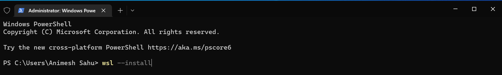

# FOSS - 01

<style>
h1 {
  color: white !important;
}
</style>

---

# Source-Compiler-Binary Analogy

<div class="text-center" style="padding: 40px;">


</div>

## Key Takeaways:

<br>

* Computers only understands binary (011010100).
* We as a programmer CAN write Binary by hand, but its very cryptic.
* So we write in a high-level construct called as Programming Language (files referred to as Source Code) and use Compilers to make binary out of it.

---

# Computers only understand binary

* As in series of instructions encoded in form of 0s and 1s
* For example .exe are the executable-binary-files in Windows
* Here's how a binary looks (for command `ls`):
  ```bash
  # Actual contents of binary
  xxd -b $(which ls) | less

  # Disassembled binary
  objdump -d -w -t $(which ls) | less
  ```
  **Don't worry about this now** (Only for demonstration)

But the problem is, it looks like gibberish trash. So, we don't ***really*** write binary by hand.

---

# Outline

* Environment Setup
  - Windows Terminal & WSL2 & Caveats from actually running Linux  <!-- Performance (1990s vs i9) | Repairability / Out of boot operations / Data Recovery | System Exploitation -->
  - VSCode
  - C Compiler (gcc)
* Hello World on C
* Extend the analogy we discussed earlier

---

# Environment Setup

* Linux & MacOS users balle balle!
* Windows users follow the next few slides :)

---

# Environment Setup (Windows Users)

Since Windows is primarily intended for consumers rather than producers (programmers), we've gotta install some stuffs before we move on!

* Install "Windows Terminal" from the Microsoft Store.<br>
  

---

# Environment Setup (Windows Users)

* Open the terminal as administrator and run: `wsl --install` to install WSL2.<br>
  
  
  <div style="clear: both;" />

  **Note:** You must not interrupt the installation, make sure to be connected to a good WiFi.<br>

* Reboot

<style>
img {max-height:100%;}
</style>

---

# Environment Setup (Windows Users)

* Thereafter open Terminal & run: `wsl`, and setup password as prompted.
* Open Terminal again, go to settings, and set default launch to `Ubuntu` (default linux profile come up from `wsl --install`).<br>
  

This will setup a full-featured Linux environment under Windows.

---

# Environment Setup (Windows Users)

### Caveats from running native Linux directly on machine (dual-boot / single-boot).

<div style="margin-top: 10px;" />

* Since you're still on Windows, you can't customize the screen however you like as you would in linux.
* Since windows isn't light, you won't get the performance benefits, a native linux can offer (No lags).

<div style="margin-top: 50px;" />

### Another Option (Linux on a Virtual Machine) from WSL2

<div style="margin-top: 10px;" />

* Is a way to run Linux with GUI under a window. So you *can* customize the screen however you like.
* But is even worse in performance, as it's too heavy and mostly laggy even in high-performance CPU.
* Doesn't integrate with Windows too nicely. As you'll see later in the slides.

<style>
h3 {
    color: skyblue;
}
</style>

---

# Environment Setup (Windows Users)

### What's better in WSL2

<div style="margin-top: 10px;" />

* In both the options (dual-or-single-boot / virtual-machine) you'll need to tweak laptop through BIOS to run them. WSL2 installs and run swiftly.
* Laptops released just this year may not have good Linux support, as such wifi may not work, which is a big issue.

**Note:** We recommend you that if you have exposed to Linux through WSL2 and like it, after a month do a dual-boot/single-boot of linux, to get full **performance** and **customization** benefits of linux.

<style>
h3 {
    color: skyblue;
}
</style>

---

# Environment Setup (VSCode)

VSCode is a easy-to-use & go to text-editor for writing source code.

* Install the vscode by downloading the installer from [their website](https://code.visualstudio.com/download) according to your platform<br>
  OR in linux (native) use your favourite package manager as instructed in [their website](https://code.visualstudio.com/docs/setup/linux)

* Install the following extensions:
  - Code Runner
  * C/C++
  - WSL (only windows users)
  - Material Theme (just for fun)

  

---

# Environment Setup (VSCode)

* Good to know keybinds:
  - Ctrl+Shift+P - Command Pallete, search whatever
  - Ctrl+Shift+` - Launch integrated terminal

Note: Windows users use Ctrl+Shift+P and search to "open folder in WSL".

---

# Environment Setup (C Compiler)

C compiler will enable you to turn your C source code into binary which you can run.

Open your terminal (regardless windows/linux/mac user), and install gcc with your favourite package manager:

```
sudo apt update && sudo apt install gcc make    # Ubuntu/Debian (also WSL; by default)
sudo pacman -Syu gcc make                       # ArchLinux & derivatives
sudo xbps-install -S gcc make                   # VoidLinux
sudo dnf install gcc make                       # Fedora/RedHat
```

Note: WSL users follow the Ubuntu/Debian way to install gcc (c-compiler we'll be using).

---

# Hello World on C

Hello World is the first program anybody writes to start the journey!

* Open any folder in the VSCode, and create a new file ending with `.c` (e.g. `main.c`) and write:
  ```c
  #include <stdio.h>

  int main() {
      printf("Hello World\n");
  }
  ```
* To run the code, we have a couple of ways:
  - Use the run button (top right) provided by the CodeRunner extension we've just installed.
  - Open a terminal window (Ctrl+Shift+\`) and run `gcc main.c -o main` (or shorthand: `make main`) and `./main` afterwards.
    
* Viola, You just written and ran your first program!

<style>
ul ul {
  font-size: 0.9rem;
}
</style>

---

# Hello World on C

Dissecting what we've just wrote

* `#include <stdio.h>` - Importing preinstalled c-library for using standard input & output (e.g. printf below).
* `int main() {` - main function is the entry point to our program, compiled languages usually follow this namescheme.
* `printf(...);` - call the `printf` function from `stdio.h`, end the statement with semicolon.
* `"Hello World\n"` - Data-Type called string (created by using double quotes `"`).<br>
  Here `\n` represents a newline character. They're called escape characters, and hence any character after backslash `\` means something new in programming, to print a backslash as it is you've to use two backslashes (`\\`).

More stuffs:

* `{ ... }` - are called the block/scopes of code. They're used to encapsulate/group multiple lines of code.
* The special grammer (i.e. to follow these weird characters `<>`, `()`, `"`, `#include`, `;`) is called syntax.<br>
  Syntax Error refers to something improper from the language grammar, that compiler couldn't understand.

<style>
ul {
  font-size: 0.9rem;
}
</style>

---

# Extend the analogy we discussed earlier

Rightmost square box is distributed. Anything right to rightmost square box needs to be on target computer.

* **Compiled Languages** (Fastest | Most restricted):

<div class="text-center">


</div>

* **ByteCode Languages** (Almost Fast | Almost Restricted):

<div class="text-center">


</div>

* **Interpreted/Scripting Languages** (Slowest | Most Flexible):

<div class="text-center">


</div>

* Interpreter job is also called "Just In Time Compilation" (JIT).
* Compiler job is also called "Ahead Of Time Compilation" (AOT).

---

# Fun Activity (15 min)

* Choose any 2 languages (other than C of course)
* Setup their compiler/interpreter on your system (within WSL/Linux/Mac)
* Write a hello world on them
* Run them and send screenshot on the WhatsApp group!

